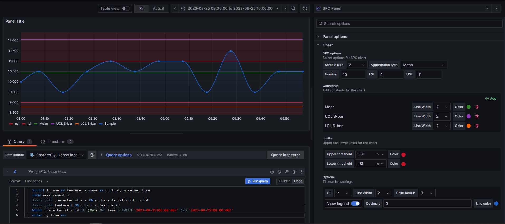
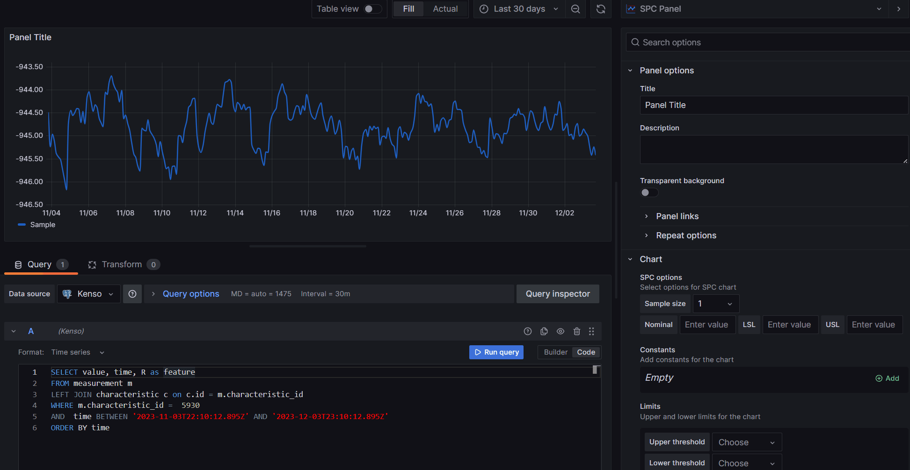
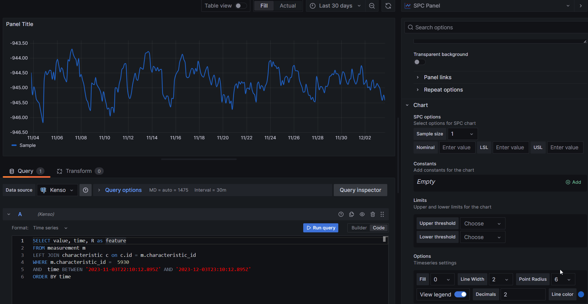
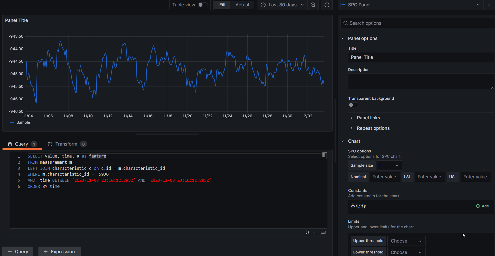

# SPC Panel

Welcome to the KensoBI SPC panel for Grafana. This plugin allows you to build common statistical process control (SPC) charts like Xbar-R and Xbar-S charts using time-series data in Grafana.


## Plugin Overview



## Available options

- **Constants:** The constants for your data visualization, such as minimum, nominal and maximum values. Data for constanst can be downloaded from a datasource or entered using an editor.

- **Limits:** The limits for your data visualization, such as Upper Specification Limit (USL), Lower Specification Limit (LSL) values. Data for Limits can be downloaded from a datasource or entered using an editor.


- **Fill:**   Customize the area or space under your graph lines. 


- **Line width:**   Adjust the width of the lines in your graph to make your data more visible and distinctive.


- **Piont radius:**  Control the size of data points in your graph, making them more or less prominent as needed.


- **View legend:**  Toggle the display of a legend to help your audience understand the data in your visualization.


- **Decimals:**  Set the number of decimal places to display in your data labels, providing more or less precision.


- **Line color:**  Customize the color of your graph lines to match your desired visual style.

## How to build X-bar R chart

### X-bar for R chart



### R Chart


## How to build X-bar S chart

### X-bar for S chart


### S chart


## Data Source Compatibility

This plugin is designed to work seamlessly with all available data sources in Grafana. Whether you are using InfluxDB, Prometheus, Elasticsearch, or any other supported data source, you can utilize the full potential of this plugin to enhance your data visualization.

Feel free to modify and customize these settings to suit your specific needs and preferences. 

## Functions documentation

The SPC Panel plug-in uses various functions to analyze data and calculate constants. For detailed information about these mathematical formulas, please refer to the section [Functions Documentation](./src/README.md).

## Installation

To install this plugin in your Grafana instance, follow these steps:

1. Download the plugin from the [plugin repository](https://grafana.com/grafana/plugins/) or [GitHub](https://github.com/KensoBI/spc-panel/releases) or use the Grafana CLI to install it.

2. Restart your Grafana server if required.

3. Configure the plugin with the options described above via the Grafana web interface.

## Building the plugin


### Frontend

1. Install dependencies

   ```bash
   yarn install
   ```

2. Build plugin in development mode and run in watch mode

   ```bash
   yarn run dev
   ```

3. Build plugin in production mode

   ```bash
   yarn run build
   ```

4. Run the tests (using Jest)

   ```bash
   # Runs the tests and watches for changes, requires git init first
   yarn run test

   # Exits after running all the tests
   yarn run test:ci
   ```

5. Spin up a Grafana instance and run the plugin inside it (using Docker)

   ```bash
   yarn run server
   ```

6. Run the E2E tests (using Cypress)

   ```bash
   # Spins up a Grafana instance first that we tests against
   yarn run server

   # Starts the tests
   yarn run e2e
   ```

7. Run the linter

   ```bash
   yarn run lint

   # or

   yarn run lint:fix
   ```

## Getting Help

If you have any questions or feedback, you can:

- Ask a question on the [KensoBI Discord channel](https://discord.gg/cVKKh7trXU).
- Create an [issue](https://github.com/KensoBI/spc-panel/issues) to report bugs, issues, and feature suggestions.

Your feedback is always welcome!


## License

This software is distributed under the [Apache License](./LICENSE).

## Notes

Copyright (c) 2023 [Kenso Software](https://kensobi.com)
