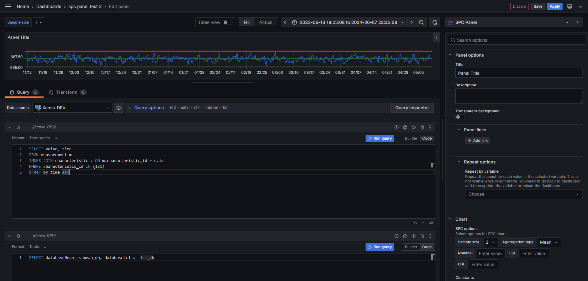

# SPC Panel

Welcome to the KensoBI SPC panel for Grafana. This plugin allows you to build common statistical process control (SPC) charts like Xbar-R and Xbar-S charts using time-series data in Grafana.


## Plugin Overview


## Available options

- **Constants:** The constants for your data visualization, such as minimum, nominal and maximum values. Data for constanst can be downloaded from a datasource or entered using an editor.

- **Limits:** The limits for your data visualization, such as Upper Specification Limit (USL), Lower Specification Limit (LSL) values. Data for Limits can be downloaded from a datasource or entered using an editor.


- **Fill:**   Customize the area or space under your graph lines. 


- **Line width:**   Adjust the width of the lines in your graph to make your data more visible and distinctive.


- **Piont radius:**  Control the size of data points in your graph, making them more or less prominent as needed.


- **View legend:**  Toggle the display of a legend to help your audience understand the data in your visualization.


- **Decimals:**  Set the number of decimal places to display in your data labels, providing more or less precision.


- **Line color:**  Customize the color of your graph lines to match your desired visual style.

## How to built SQL query



### Building a chart using PostgreSQL datasource

To create a chart, you must run an SQL query. In PostgreSQL datasource, you need to select the Time series data format and then write the SQL query. The data should include **value** and **time**. The time should be saved in the database as timestamp. 

**SQL query example:**

```
SELECT value, time
FROM measurement m
INNER JOIN characteristic c ON m.characteristic_id = c.id
WHERE characteristic_id IN (151) 
order by time asc
```
### Custom constants values in the chart

SPC Panel, in addition to standard calculations, allows you to add additional constants values on the chart. These values can be selected from the database using a simple SQL query in **Table** format. For everything to work properly, the PostgreeSQL datasource should contain 2 separate queries, the chart should be in **Time series** format, and constants should be in **Table** format. 

The following names are reserved for calculations in the panel and should be avoided when writing SQL queries: nominal, lsl, usl, min, max, mean, range, lcl_Rbar, ucl_Rbar, lcl_Sbar, ucl_Sbar, lcl, ucl.

**SQL query example:**
```
SELECT databaseMean as mean_db, databaseLcl as lcl_db
```


## How to build X-bar R chart

### X-bar for R chart


### R Chart


## How to build X-bar S chart

### X-bar for S chart


### S chart


## Data Source Compatibility

This plugin is designed to work seamlessly with all available data sources in Grafana. Whether you are using InfluxDB, Prometheus, Elasticsearch, or any other supported data source, you can utilize the full potential of this plugin to enhance your data visualization.

Feel free to modify and customize these settings to suit your specific needs and preferences. 

## Functions documentation

The SPC Panel plug-in uses various functions to analyze data and calculate constants. For detailed information about these mathematical formulas, please refer to the section [Functions Documentation](https://github.com/KensoBI/spc-panel/blob/main/src/SPC_FUNCTIONS.md).


## Getting Help

If you have any questions or feedback, you can:

- Create an [issue](https://github.com/KensoBI/spc-panel/issues) to report bugs, issues, and feature suggestions.
- Ask a question on the [KensoBI Discord channel](https://discord.gg/cVKKh7trXU).

Your feedback is always welcome!


## License

This software is distributed under the [Apache License](https://raw.githubusercontent.com/KensoBI/spc-panel/main/LICENSE).

## Notes

Copyright (c) 2023 [Kenso Software](https://kensobi.com)
